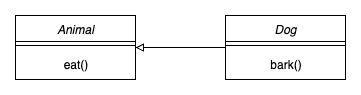
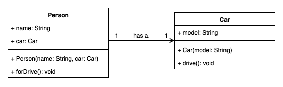
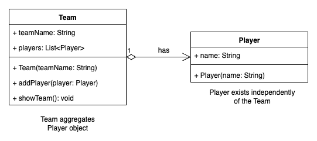
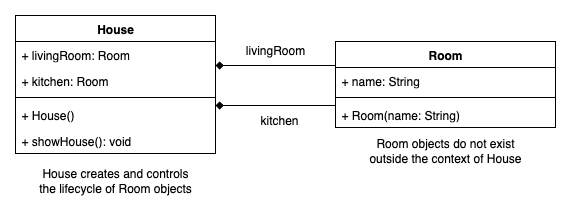
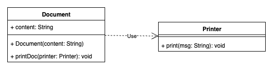
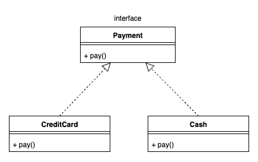
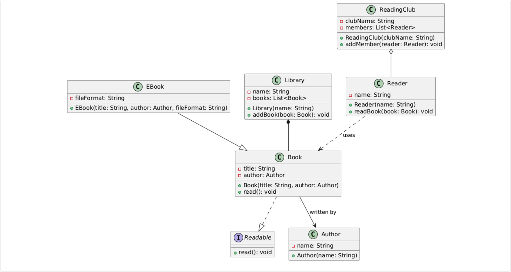

# 📘 Module 06: Class Relationships – A Deep Dive

## 🔹 1. Overview
Class relationships define how classes in an object-oriented system interact.  
They answer questions like:
- **Who owns whom?**
- **Who depends on whom?**
- **Who outlives whom?**
- **How much coupling exists?**

Getting this right makes systems **testable, maintainable, and scalable**.  
Getting it wrong leads to **memory leaks, brittle APIs, and tangled dependencies**.


## 🔹 2. Types of Class Relationships

## ➤ Inheritance

**Definition:** Inheritance represents an **"is-a"** relationship where a subclass inherits properties and behaviours from its parent class.

**When to use:**
- Subtypes share a stable core of behavior with the base.

- You want polymorphism (work with a Base reference and dispatch to the right override).

- The hierarchy is shallow and well-justified.

> If behavior diverges a lot or you foresee frequent changes, prefer composition over inheritance.

**Example:**

Code: 
 
```java
// parent class
class Animal { 
    void eat() {
        System.out.println("Animal is eating");
    }
}

// subclass inheriting from class Animal
class Dog implements Animal { 
    void bark() {
        System.out.println("Dog is barking");
    }
}

public class InheritanceExample {
    public static void main(String[] args) {
        // Object of class Dog
        Dog dog = new Dog(); 

        // specific : calling the function bark()
        dog.bark(); 

        // inherited : calling the function eat()
        dog.eat(); 
    }
}

```
Output : 
```
Dog is barking
Animal is eating
```

**Explanation:**  
- `Animal` is the **base class**.  
- `Dog` and `Cat` **extend** `Animal` and **override** `speak()` to provide subtype-specific behavior.  
- This shows **polymorphism**: calling `speak()` on an `Animal` reference dynamically dispatches to the correct subtype’s implementation.  
- Subclass-only methods (like `fetch()`) require a downcast.  

**Why this is Inheritance:**  
- Relationship is **“is-a”**.  
- Subtypes override and extend behavior.  

**Pitfalls:**  
- Don’t inherit just for code reuse (breaks LSP).  
- Prefer shallow hierarchies; diverging behavior is better modeled via **Strategy/Composition**.

**Class Diagram:** 



## ➤ Association

**Definition:** Association is a general relationship where one class knows about/uses another class. 
<br>
> Its like a Friendship - two entities are aware of each other but they exist independently.

**When to use:**
- When one object regularly collaborates with another but **does not own its lifecycle**.  
- Example: A `Person` can use a `Car`, but both can exist independently. 

**Example:**

Code:

```java
//A Person has a Car
class Car {
    String model;
    Car(String model) {
        this.model = model;
    }
    void drive() {
        System.out.println("Driving a "+model);
    }
}

class Person {
    String name;
    Car car; // Association: a Person 'has-a' Car
    Person(String name, Car car) {
        this.name = name;
        this.car = car;
    }
    void forDrive() {
        System.out.println(name + "is going for a drive");
        car.drive();
    }
}

class AssociationExample {
    public static void main(String[] args) {
        Car car = new Car("Tata Safari");
        Person person = new Person("Ayush", car);
        person.goDrive();
    }
}
```

Output:

```
Ayush is going for a drive
Driving a Tata Safari
```

**Explanation:**  
- `Person` **has a reference** to a `Car` and uses it in `goForDrive()`.  
- Both `Person` and `Car` are **independent lifecycles**.  
- This is **unidirectional association**: only `Person` knows about `Car`.  

**Why this is Association:**  
- `Person` does not own `Car`.  
- If `Person` is destroyed, `Car` can still exist.  

**Pitfalls:**  
- Default to **unidirectional** association to avoid tight coupling.  
- If the collaborator is short-lived, pass it as a **method parameter** (Dependency) instead of storing it.


**Class Diagram:**



## ➤ Aggregation

**Definition:** Aggregation is a specialized form of association that represents a **"has-a"** relationship where the parts can exist independently of the whole, but they are grouped together by a container.
> Think of a team and its players : A team has players, yet the players can exist even if the team is disbanded

**When to use:**
- When a class logically groups objects, but does **not control their lifecycle**.  
- Use Aggregation when the contained objects can **outlive** the container.  

**Example:**

Code:

```java
import java.util.ArrayList;
import java.util.List;

class Player {
    String name;
    Player(String name) {
        this.name = name;
    }
}

class Team {
    String teamName;
    // Aggregation: a Team "has" Players 
    List<Player> players = new ArrayList<>();
    Team(String teamName) {
        this.teamName = teamName;
    }
    void addPlayer(Player player) {
        players.add(player);
    }
    void showTeam() {
        System.out.println("Team "+ teamName +" has players:");
        for(Player p: player) {
            System.out.println(p.name);
        }
    }
}

class AggregationExample {
    public static void main(String[] args) {
        Team team = new Team("Warriors");
        team.addPlayer(new Player("Ayush Mangal"));
        team.addPlayer(new Player("John Doe"));
        team.addPlayer(new Player("Tony Stark"));
        team.showTeam();
    }
}
```

Output:

```
Team Warriors has players:
Ayush Mangal
John Doe
Tony Stark
```

**Explanation:**  
- `Team` groups multiple `Player` objects using a `List<Player>`.  
- `Player` objects are **independent** of `Team` and can exist before, outside, or after the `Team`.  
- The `Team` **has-a** collection of players, but does not control their lifecycle.  

**Why this is Aggregation:**  
- Parts (Players) can **outlive** the whole (Team).  
- A player could belong to multiple teams, or exist without any team.  

**Pitfalls:**  
- Always **initialize collections** to avoid `NullPointerException`.  
- Return **defensive copies** when exposing collections (`List.copyOf(players)`).  
- If you want the container to fully own the lifecycle of its parts, use **Composition** instead.


**Class Diagram:**



## ➤ Composition

**Definition:** Composition is a stronger form of aggregation with **full ownership**. If the whole is destroyed, the parts cannot exist independently.
> Think of a house and its rooms: Without the house, the rooms cease to exist.

**When to use:**
- When the lifecycle of the part is **completely dependent** on the whole.  
- When parts should **not exist** outside the container.  
- To enforce **tight ownership** and prevent accidental reuse of components.

**Example:**

Code:

```java
class Room {
    String name;
    Room(String name) {
        this.name = name;
    }
}

class House {
    // Composition: A House is composed of Rooms
    private Room livingRoom;
    private Room kitchen;
    House() {
        // Rooms are created and owned by the House
        livingRoom = new Room("Living Room");
        kitchen = new Room("Kitchen");
    }
    void showHouse() {
        System.out.println("House contains "+ livingRoom +" and a "+kitchen);
    }
}

class Composition {
    public static void main(String[] args) {
        House house = new House();
        house.showHouse();
    }
}
```

Output:

```
House contains Living Room and a Kitchen
```

**Explanation:**  
- `House` directly **creates** and **owns** `Room` objects inside its constructor.  
- The `Room`s cannot exist without the `House`—they are **tied to its lifecycle**.  
- If the `House` object is destroyed, its `Room`s are also destroyed.  

**Why this is Composition (and not Aggregation):**  
- In **Aggregation**, parts (like Players in a Team) can exist independently of the whole.  
- In **Composition**, parts (like Rooms in a House) are tightly bound to the whole and cannot exist alone.  

**Pitfalls:**  
- Composition increases **coupling** because the container fully manages its parts.  
- Avoid overusing it—if parts can logically exist without the container, prefer **Aggregation** instead.


**Class Diagram:**



## ➤ Dependency

**Definition:** Dependency represent a temporary relationship where one class uses another class, typically via method paramters or local variables.
> It's like borrowing a tool for a short while.

**When to use:**  
- When one class needs another only **temporarily** to complete a task.  
- When passing collaborators as **method parameters** is cleaner than storing them as fields.  
- When you want to reduce **coupling** by not permanently linking two classes.  
- Common in **utility usage** (e.g., Logger, Printer, Validator, Database connection helper).  

**Example:**

Code:

```java
class Printer {
    void print(String message) {
        System.out.println(message);
    }
}

class Document {
    String content;
    Document(String content) {
        this.content = content;
    }

    // Dependency: Document uses 'Printer' to print its content
    void printDoc(Printer printer) {
        printer.print(content);
    }
}

class DependencyExample {
    public static void main(String[] args) {
        Document doc = new Document("Hello, World!");
        Printer printer = new Printer();
        doc.printDoc(printer);
    }
}
```

Output:

```
Hello, World!
```

**Explanation:**  
- `Document` does **not own** a `Printer` object. Instead, it **borrows** one when needed (through the `printDoc()` method).  
- This makes the relationship **temporary** — the `Printer` is passed as a method parameter, and `Document` does not store it as a field.  
- Once the method call is done, the dependency ends.  

**Why this is Dependency (and not Association):**  
- In **Association**, one class stores a long-lived reference to another (e.g., `Person` has a `Car`).  
- In **Dependency**, the relationship exists only during a method call (short-lived).  
- If the collaborator is replaced or absent, the dependent class can still exist, it just won’t perform that action.  

**Pitfalls:**  
- Too many dependencies can make methods **bloated** (large parameter lists).  
- If dependencies become **long-lived**, refactor into **Association** or **Dependency Injection**.  
- Overusing dependencies without interfaces makes testing harder — prefer depending on **abstractions** instead of concrete classes.


**Class Diagram:**



## ➤ Realization
**Definition:** Realization represents a relationship where a class implements on interface.
> It's like signing a contract to provide specific behaviours.

**When to use:**  
- When you want to define a **contract (interface)** that multiple classes can implement differently.  
- When different classes should provide their own **implementation of the same behavior**.  
- To achieve **loose coupling** and follow the **Dependency Inversion Principle (DIP)**.  
- Common in strategy-based designs (e.g., different payment methods, authentication mechanisms, storage providers).  

**Example:**

Code:

```java
interface Payment {
    void pay();
}

class CreditCard implements Payment {
    @Override
    public void pay() {
        System.out.println("Paid using Credit Card");
    }
}

class Cash implements Payment {
    @Override
    public void pay() {
        System.out.println("Paid using Cash");
    }
}

public class RealizationExample {
    public static void main(String[] args) {
        Payment payment1 = new CreditCard();
        Payment payment2 = new Cash();
        payment1.pay();
        payment2.pay();
    }
}
```

Output:

```
Paid using Credit Card
Paid using Cash
```

**Explanation:**  
- `Payment` is an **interface** (a contract) that defines a method `pay()`.  
- `CreditCard` and `Cash` **realize** this interface by providing their own implementation of `pay()`.  
- In `main`, both objects are referenced through the **Payment interface**, which allows polymorphism — the correct implementation is chosen at runtime.  
- This enables flexibility: you can add new payment methods without changing existing code, only by introducing new classes that **implement Payment**.  

**Why this is Realization (and not Inheritance):**  
- Inheritance shares behavior and state from a **base class**.  
- Realization only promises to **implement defined behaviors** of an interface (no shared code, just a contract).  

**Pitfalls:**  
- Overusing interfaces can lead to **unnecessary abstraction** (“interface pollution”).  
- Avoid creating interfaces with only one implementation — keep them meaningful.  
- If too many methods are forced into one interface, it may violate the **Interface Segregation Principle (ISP)**.  

**Class Diagram:**



## 🔹 3. Library Management System 

### 1. Problem Statement
Design and implement a minimal **Library Management System** using Java to demonstrate **all class relationships**.

---

### 2. Functional Requirements
- Add **Authors** and **Books**.
- A **Book** has a **title** and an **Author**.
- Add **Ebooks** (a kind of Book) that also store a **fileFormat**.
- A **Library** groups many **Books** and can list them.
- A **Reader** can **read a Book**.
- A **ReadingClub** can add **Readers** and show members.

---

### 3. Non-functional / Design Requirements
- Demonstrate:
  - **Inheritance** → `Ebook extends Book`
  - **Realization** → `Book implements Readable`
  - **Association** → `Book → Author`
  - **Aggregation** → `Library ◇– Book`, `ReadingClub ◇– Reader`
  - **Dependency** → `Reader.readBook(Book)`
- Use proper **packages** (author, book, ebook, library, reader, readable, readingclub, app).
- Keep fields private; prefer `final` where possible.

---

### 4. Class Diagram


---

### 5. Folder Structure
```
LMS/
author/Author.java
book/Book.java
ebook/Ebook.java
library/Library.java
reader/Reader.java
readable/Readable.java
readingclub/ReadingClub.java
app/Main.java
```

---
### 6. Code Files
- [Author.java](./LMS/author/Author.java)  
- [Book.java](./LMS/book/Book.java)  
- [Ebook.java](./LMS/ebook/Ebook.java)  
- [Library.java](./LMS/library/Library.java)  
- [Reader.java](./LMS/reader/Reader.java)  
- [Readable.java](./LMS/readable/Readable.java)  
- [ReadingClub.java](./LMS/readingclub/ReadingClub.java)  
- [Main.java](./LMS/app/Main.java)  

---
### 7. Output

```
Ayush starts reading:
Book name is 1984 written by George Orwell
John starts reading:
Book name is Clean Code written by Robert C. Martin
John starts reading:
File format: PDF

--- Library Catalogue ---
Book name is 1984 written by George Orwell
Book name is Clean Code written by Robert C. Martin
File format: PDF

--- Reading Club Members ---
Ayush
John
```

---

## 🔹 4. Conclusion  

In this module, we explored the **six fundamental class relationships** — Inheritance, Association, Aggregation, Composition, Dependency, and Realization.  
Each relationship was broken down into:  
- **Definition & Use Cases** → when and why to apply it.  
- **Code Examples & Diagrams** → to visualize the concept.  
- **Pitfalls** → to avoid common design mistakes.  

Finally, we brought them all together in a **Library Management System (LMS)**, showing how these relationships interact in a real-world style design.  

Mastering these relationships is essential because:  
- They are the **building blocks of Object-Oriented Design (OOD)**.  
- They directly influence how scalable, maintainable, and testable your system becomes.  
- They are the **language of UML & System Design interviews** — being able to model problems using these relationships sets you apart.  

> 🏆 The key takeaway: **Good design is not about using every relationship everywhere, but about choosing the *right* one for the problem at hand.**
