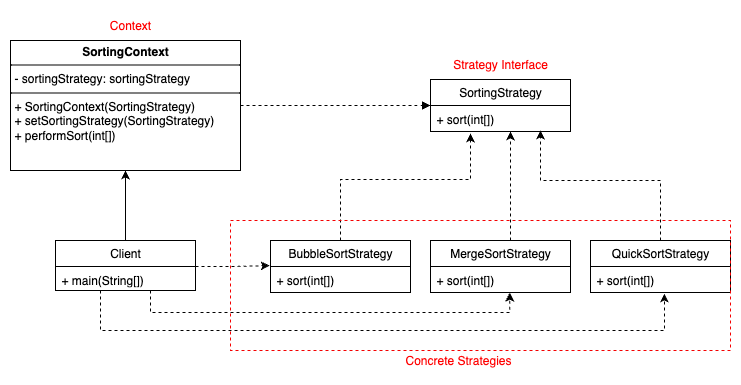

# 🧠 Strategy Pattern

## 🧾 Definition

> The **Strategy Pattern** defines a family of algorithms, encapsulates each one, and makes them interchangeable. It allows the algorithm to vary independently from clients that use it.

---

## 🎯 When to Use

- You have **multiple ways** of performing an action (like different payment methods or sorting techniques).
- You want to **replace conditionals (`if-else`, `switch-case`)** with clean, maintainable code.
- You want to follow **Open/Closed Principle** – add new logic without modifying existing code.

---

## 🧱 Components

| Component | Role |
|----------|------|
| `Strategy` Interface | Declares common method for all algorithms |
| `ConcreteStrategy` Classes | Each implements a specific algorithm |
| `Context` | Accepts a strategy and uses it to perform the operation |

---

## 📂 Examples in This Folder

---

### 🛒 Payment System | [View Code](./payment-system/Client.java)

**Description**: Implements a dynamic payment processing system using the Strategy Pattern.
Users can switch between different payment methods like Credit Card or PayPal at runtime without altering the core logic of the system.

**Context**: A payment gateway that supports multiple payment methods: Credit Card and PayPal.  

**Strategy Used**: Each payment method implements a `PaymentStrategy` interface.  

**Goal**: Add or switch payment methods without touching client code.

#### UML Diagram

---

### 🧭 Navigation App | [View Code](./navigation-app/Client.java)

**Description**: Simulates a map/navigation application where the route calculation varies depending on the mode of transportation: Bike, Car, or Walk.
Each mode is encapsulated in its own strategy, allowing the context to delegate routing logic accordingly.

**Context**: A navigation app where the user can select their mode of travel: Bike, Car, or Walk.  

**Strategy Used**: Each mode implements a `RouteStrategy` to calculate time/distance.  

**Goal**: Allow dynamic switching of navigation logic based on travel mode.

#### UML Diagram

---

### 🔃 Sorting Application | [View Code](./sorting-application/Client.java)

**Description**: Implements a sorting system where the sorting algorithm can be selected dynamically.
Supports strategies like Bubble Sort, Merge Sort, and Quick Sort, allowing users or developers to inject their preferred sorting method at runtime.

**Context**: An app that allows users to sort data using different algorithms like Bubble Sort or Quick Sort.  

**Strategy Used**: Sorting algorithms are encapsulated via a `SortStrategy` interface.  

**Goal**: Choose and apply sorting dynamically at runtime.

**UML Diagram**:

